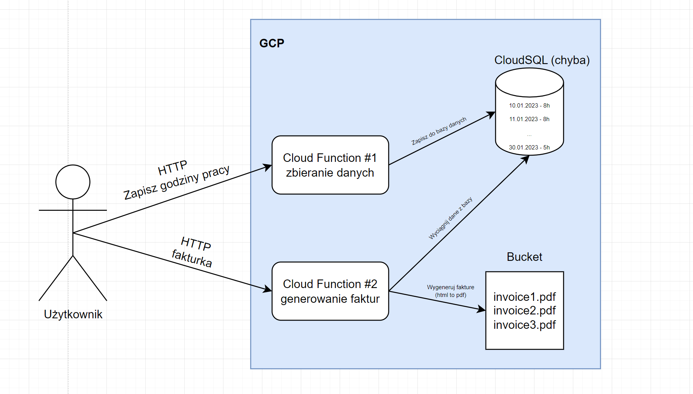

# Sabre GCP

### Opis projektu
Pewien ktoś rozlicza się w pracy w wymiarze godzinowym - ile godzin przepracuje w miesiącu, za tyle dostaje wynagrodzenie. Wynagrodzenie wypłacane jest na podstawie faktury wygenerowanej przez ktosia.

Celem projektu jest ułatwienie zliczania przepracowanych godzin w miesiący oraz automatyzacja generowania faktur.

Projekt udostępnia 2 funkcje:
* Zapytanie HTTP do pierwszej powoduje zapisanie ilości przepracowanych godzin w danym dniu do bazy danych (ktoś codziennie po pracy wykonuje taki call do funkcji)
* Zapytanie HTTP do drugiej funkcji powoduje zebranie danych za miesiąc z bazy danych, zliczenie godzin i wygenerowanie faktury w formacie PDF (ktoś wywołuje taki call raz w miesiącu)

### Diagram

### Automatyzacja
Wykonana za pomocą terraforma